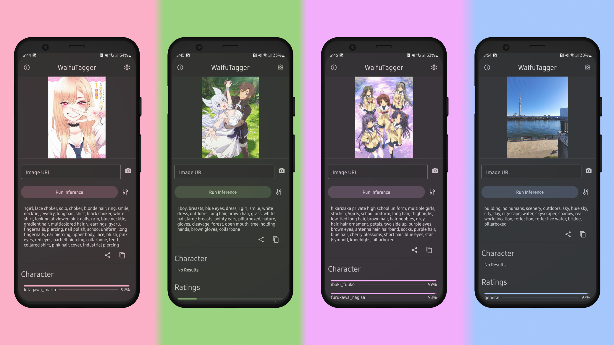

# WaifuTagger

Run SmilingWolfs [WD Convnext Tagger v3](https://huggingface.co/SmilingWolf/wd-convnext-tagger-v3) model on mobile and [WD SwinV2 Tagger v3](https://huggingface.co/p1atdev/wd-swinv2-tagger-v3-hf) on desktop!

## 🎮 Platforms
Android and Desktop (Windows, MacOS, Linux)

## 💾 Download
Take a look at the latest [release](https://github.com/KuzuLabz/WaifuTagger/releases/latest)!

## 🤗 Model
#### Mobile
To run the model on mobile, I quantized it and added preprocessing using [onnxruntime-extentions](https://onnxruntime.ai/docs/extensions/). This model is available on my [HuggingFace](https://huggingface.co/Smashinfries/wd-convnext-tagger-v3-mobile). You can also find more details about the process there.

#### Desktop
Desktop is using p1atdev's transformers version of the [WD SwinV2 Tagger v3](https://huggingface.co/p1atdev/wd-swinv2-tagger-v3-hf) model due to some ops (decodeImage) not working with onnxruntime-web. 

The WASM backend is used for inference.

## 🎯 Model Accuracy
#### Mobile
If you get bad results, it's highly likely that I did something wrong with the preprocessing. Any tips for improvement would be appreciated.

#### iOS Notes
- This app uses [expo-share-intent](https://github.com/achorein/expo-share-intent) and will need additional setup for iOS.
