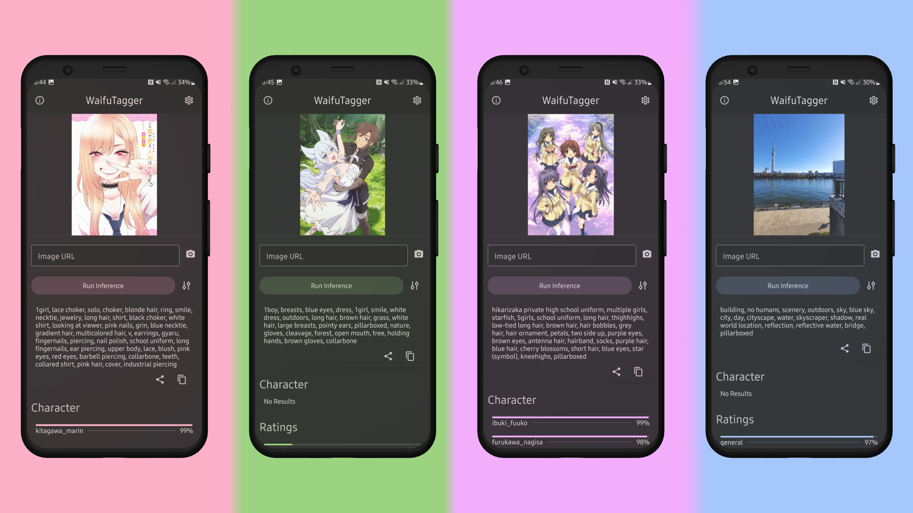

# WaifuTagger

Run anime image classification models on mobile and desktop!

## 💾 Download
Take a look at the latest [release](https://github.com/KuzuLabz/WaifuTagger/releases/latest)!

## Features
- 🗂️ Model manager - select from a range of models
- 🏷️ Tag any image (anime, manga, real photos) with booru tags
- 🔍 Discover what anime characters are in an image
- 📝 Modify the tags output format (spaces, underscores, prompt)
- ⭐ Leveling system based on image rankings 
- 🔞 Detects if an image is explicit, questionable, sensitive, or safe
- 🔗 Direct link to tag information
- 🎨 UI theme colors based on input image
- 🌐 Language support: English, Chinese, Japanese, Korean, French, German, Spanish 

## Models
Models are available in QUINT8 and FP16. View the [model catalog](https://github.com/KuzuLabz/WaifuTagger/blob/master/src/model-list.json) for more details.

*More models are planned!* 

#### SmilingWolf
- [WD Convnext Tagger v3](https://huggingface.co/Smashinfries/wd-convnext-tagger-v3-onnx-mobile)
- [WD Swinv2 Tagger v3](https://huggingface.co/Smashinfries/wd-swinv2-tagger-v3-onnx-mobile)

#### Camais03
- [Camie Tagger v2](https://huggingface.co/Smashinfries/camie-tagger-v2-onnx-mobile)

### Submitting new models
WaifuTagger uses modified ONNX models to make mobile inference easier. 

Feel free to send a PR to add a new model!

#### Requirements
- Input: Uint8Array of rgb data (uint8[1,height,width,3])
- Ouput: Float32Array with sigmoid applied
- Quantization: At least FP16
- File name: "{model-name}-{quant}-mobile.onnx"

For reference, checkout the [WaifuTagger Model Collection](https://huggingface.co/collections/Smashinfries/waifutagger-models). Most model repos in the collection should contain a python notebook.